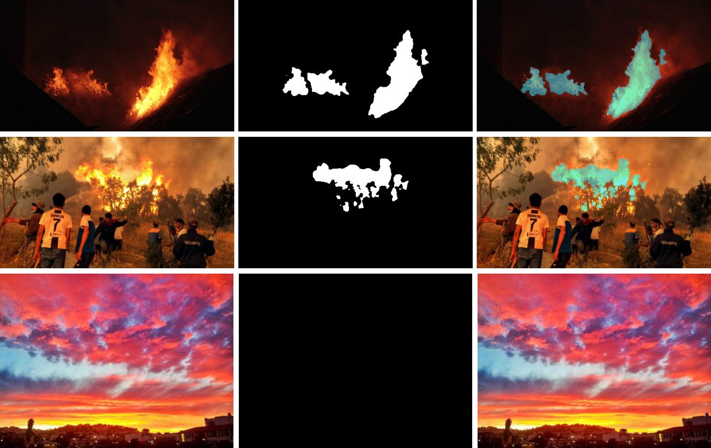
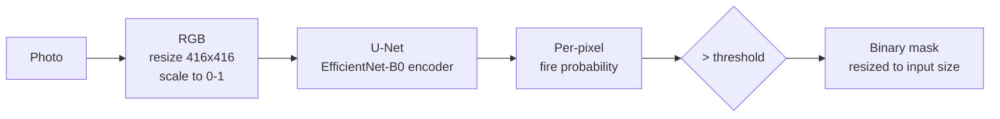

# 🔥 Fire Segmentation

Pixel-level fire segmentation served as a Streamlit web app.
Upload a photo and the app highlights the regions that contain fire.

[](https://YOUR-APP.streamlit.app)
[](https://github.com/farisznafis/fire-segmentation/actions/workflows/ci.yml)


<sub>Input, predicted mask, and overlay on photos from `dataset/testing`, which the model never saw during training.
The fire-coloured sunset in the last row is correctly left empty.</sub>

## Features

- Upload your own image (JPG, PNG, WEBP) or try one of the 50 bundled sample photos
- Adjustable mask threshold
- Original, mask, and overlay shown side by side, plus fire-coverage percentage
- Download the predicted mask as a PNG
- Lightweight inference: a 23 MB ONNX model on ONNX Runtime (CPU), no deep-learning framework needed at runtime

## Results

All numbers are measured on data that was **not used for training**. Both models are
evaluated on exactly the same images with the same 0.5 threshold.

| Held-out set | Metric | v1 (grayscale U-Net) | **v2 (current)** |
| --- | --- | --- | --- |
| BoWFire photos, 68 (fire + fire-like) | Fire IoU | 0.18 | **0.81** |
| | Precision / recall | 0.28 / 0.32 | **0.92 / 0.88** |
| | False alarms on fire-free photos | 81% | **6%** |
| Fire-free photos, 64 | False alarms | 58% | **0%** |
| `dataset/testing/non-fire`, 35 | Flagged as fire | 31 | **3** |
| `dataset/testing/fire`, 14 | Fire found | 12 | 12 |
| Unseen videos 3, 8 and 11, 660 frames | Fire IoU | n/a¹ | 0.50 |

A false alarm is a fire-free image with more than 0.5% of its pixels marked as fire.

¹ v1 was trained on a random 80% of all video frames, so it saw these videos.
Its earlier mean IoU of 0.90 measured frames from training videos.
On unseen videos, v2 is precise (0.93) but conservative (recall 0.52).
The labels of video 3 are coarse polygons that include dim regions behind trees, which caps the achievable IoU.

For v2, the BoWFire, fire-free, and video rows come from a run that excluded those sets from training.
The shipped model uses the same recipe retrained on all data.
The `dataset/testing` rows are for the shipped model, which never trains on those photos.
Reproduce them with `python scripts/evaluate.py --model <onnx>`.

## How it works



**Model.** The model is a U-Net whose encoder is an ImageNet-pretrained EfficientNet-B0
([segmentation-models-pytorch](https://github.com/qubvel-org/segmentation_models.pytorch)), with 6.3M parameters.
ImageNet normalisation is built into the exported ONNX graph.

**Data.** Three sources are combined:

| Source | Images | Role |
| --- | --- | --- |
| `dataset/segmentation`: 12 fire videos with masks | 2,683 frames | fire, video footage |
| [BoWFire](https://bitbucket.org/gbdi/bowfire-dataset): photos with masks, downloaded by script | 226 (119 fire, 107 fire-like) | diverse photos and hard negatives such as sunsets and lamps |
| `dataset/detection/*/not_fire` | 320 | fire-free photos with empty masks |

**Training** ([`training/train.py`](training/train.py)) uses:
- RGB input with random crops, flips, light colour jitter, blur, noise, and JPEG artefacts
- BCE + Dice loss, AdamW, and a cosine schedule over 40 epochs
- Mixed precision on GPU; about 30 minutes on an RTX 4060 Ti

Validation holds out whole videos plus 30% of BoWFire and 20% of the fire-free photos, so that no near-duplicate frames leak.
The photos in `dataset/testing` are never used for training or model selection.

Different encoders (EfficientNet-B0/B3, ResNet34) and input sizes (320–416) scored within noise of each other.
Adding diverse photos with masks made the difference.

### Model history

- **v1:** a U-Net trained from scratch on grayscale frames
  ([`notebooks/segmentation.ipynb`](notebooks/segmentation.ipynb)).
  Without colour and without fire-free examples, it learned "bright blob = fire".
- **Experiment:** a two-stage pipeline ([`notebooks/detection.ipynb`](notebooks/detection.ipynb)).
  A ResNet50 classifier (fire / not fire, 0.917 validation accuracy) gates the segmentation.
  The app does not use it.
- **v2:** the current model. Its main changes are RGB input, a pretrained encoder, real photos and hard negatives in the data, and video-level validation.

## Project structure

```
├── app.py                      # Streamlit app
├── fire_segmentation/          # inference package used by the app (numpy, OpenCV, ONNX Runtime)
│   ├── config.py
│   ├── inference.py            # preprocessing, prediction, overlay
│   └── model.py                # ONNX model loader
├── models/fire_segmentation.onnx
├── training/                   # PyTorch training code
│   ├── data.py                 # datasets and the hold-out split
│   ├── model.py
│   └── train.py
├── scripts/
│   ├── download_bowfire.py     # fetch the BoWFire dataset into external/
│   └── evaluate.py             # evaluate an ONNX model through the app's code path
├── notebooks/                  # v1 training and the detection experiment
├── dataset/
│   ├── segmentation/           # video frames + ground-truth masks (12 videos)
│   ├── detection/              # fire / not_fire classification images
│   └── testing/                # extra photos for testing, used as samples in the app
├── tests/
└── docs/
```

## Getting started

Requirements: Python 3.10–3.12.

```bash
git clone https://github.com/farisznafis/fire-segmentation.git
cd fire-segmentation

python -m venv .venv
source .venv/bin/activate        # Windows: .venv\Scripts\activate
pip install -r requirements.txt

streamlit run app.py
```

Set `FIRESEG_MODEL_PATH` to use a different ONNX model file.

## Deploy to Streamlit Community Cloud

1. Push the repository to GitHub.
2. On [share.streamlit.io](https://share.streamlit.io), click **Create app**, pick the repo and branch, and set the main file to `app.py`.
3. Under **Advanced settings**, choose **Python 3.12**.
4. Deploy. The model ships in the repo and `requirements.txt` only contains lightweight runtime packages.

## Training and evaluation

```bash
# PyTorch with CUDA (pick the build for your GPU / OS at pytorch.org)
pip install torch torchvision --index-url https://download.pytorch.org/whl/cu124
pip install -r requirements-dev.txt

python scripts/download_bowfire.py                     # ~290 MB, into external/

# 1. Hold-out run: train with validation sets excluded, report metrics
python -m training.train --out runs/holdout --export runs/holdout/model.onnx
python scripts/evaluate.py --model runs/holdout/model.onnx

# 2. Final model: same recipe on all data, exported for the app
python -m training.train --no-holdout --out runs/final --export models/fire_segmentation.onnx
```

Run the tests and linter with `pytest` and `ruff check .`.

## Limitations

- **Small or distant flames** such as a campfire in a wide shot or embers in charcoal can be missed.
  The video data mostly shows large fires, and the photo data is small (226 images).
- **Vivid sunset clouds** are the most common false alarm.
- **Coarse video labels.** Some video masks are rough polygons, which limits pixel-level scores on video.

The most promising next step is more labelled photos, especially small fires and fire-like scenes.

## Credits

- BoWFire dataset: D. Y. T. Chino, L. P. S. Avalhais, J. F. Rodrigues and A. J. M. Traina,
  "BoWFire: Detection of Fire in Still Images by Integrating Pixel Color and Texture Analysis",
  SIBGRAPI 2015, doi:10.1109/SIBGRAPI.2015.19. Images from Flickr under Creative Commons licenses.
- Fire video dataset in `dataset/segmentation`: <!-- TODO: add the source / citation -->

## License

Code: [MIT](LICENSE). Datasets keep their original licenses.
